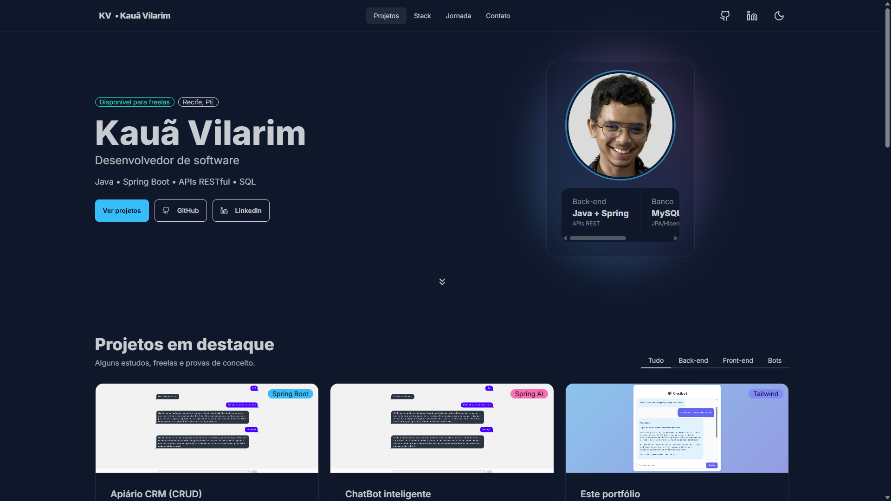

# 🌐 Portfólio — Kauã Vilarim

Bem-vindo(a) ao meu portfólio! Aqui você encontra minha trajetória como Desenvolvedor de Software e uma curadoria dos meus projetos.

## 📍 Recife, Pernambuco | 📫 Contato: kauavilarim@gmail.com | 🌐 GitHub: [@Miraliv](https://github.com/Miraliv) | 💼 LinkedIn: [/in/kaua-vilarim](https://www.linkedin.com/in/kaua-vilarim/)

## ✨ Visão geral

Este projeto é uma página de portfólio pessoal construída com HTML + TailwindCSS + DaisyUI (via CDN) e JavaScript. O foco é entregar simplicidade, velocidade e clareza, com recursos úteis no front-end:

- 🎯 Design responsivo com UI moderna
- 🌓 Alternância de tema (light/night) com persistência em localStorage
- 🗂️ Filtro de projetos por categoria (Back-end, Front-end, Bots)
- 🔗 Links sociais e CTA visíveis desde o header
- 🧭 Navbar sticky com highlight da seção ativa conforme o scroll
- 📋 Botões de copiar (e-mail/telefone) na seção de contato
- 🖼️ Imagens com loading="lazy" e thumbs dedicados em /images
- 🧩 Sem build obrigatório — roda apenas com um arquivo HTML

## 📸 Preview

Uma imagem vale mais que mil palavras. Veja um preview da interface:




## 🧱 Estrutura do projeto
```
├── src/
│   ├── images/
│   │   ├── Apiario.png
│   │   ├── portfolio.png
│   │   └── SpringAI_interface.png
│   ├── index.html
│   ├── input.css
│   └── output.css
├── .gitattributes
├── .gitignore
├── package-lock.json
├── package.json
├── README.md
└── tailwind.config.js
```

**ℹ️ Observação**: O projeto usa Tailwind Play CDN e DaisyUI (CDN), então não há necessidade de pipeline de build para começar.

## 🛠️ Tecnologias & recursos

- **Frontend**: HTML5, TailwindCSS, DaisyUI, JavaScript (puro)
- **UI/UX**: Google Fonts (Inter, JetBrains Mono), Icons (Lucide)
- **Acessibilidade & UX**: Foco visível, contraste do tema night, navegação por teclado na navbar/dropdown
- **SEO**: `<meta name="description" ...>` já configurado

## 🧩 Seções

### Início (Hero)

- Badge de disponibilidade, localização, nome, título e botões de ação (Projetos, GitHub, LinkedIn).

### Projetos em destaque

- Cards com imagem, descrição, badges e link para código.
- Inclui filtros por categoria (Tudo, Back-end, Front-end, Bots).

**Projetos exibidos**:

- **Apiário CRM (CRUD)** — Spring Boot + MySQL + Docker + Bootstrap
- **ChatBot inteligente** — Java 21 + Spring AI + Llama3 (Ollama) + Tailwind/DaisyUI + Axios
- **Este Portfólio** — HTML + Tailwind + DaisyUI

### Tech Stack

Pilares técnicos por área (Back-end, Front-end, Banco de Dados, Qualidade, DevOps, Processos, Idiomas).

### Jornada

Linha do tempo (timeline) com experiências:

- **Prefeitura do Recife** — Desenvolvedor Java (Estágio)
- **Netmake** — Analista de Suporte (Estágio)

### Contato

Links rápidos + botões de copiar para e-mail e telefone.

## ⚙️ Comportamentos implementados

- Alternância de tema (light ↔ night) via data-theme + localStorage
- Filtro de projetos por categoria (tabs com data-filter)
- Active nav link conforme a seção visível no scroll
- Copy to clipboard nos botões de contato
- Ano automático no footer

## 🤝 Créditos

- TailwindCSS
- DaisyUI
- Lucide Icons
- Google Fonts — Inter & JetBrains Mono

## 📄 Licença

Projeto pessoal de portfólio. Uso não-comercial.  
Sinta-se à vontade para se inspirar no layout/estrutura e referenciar este repositório.

## 📬 Contato

- ✉️ **E-mail**: kauavilarim@gmail.com
- 📞 **Telefone**: (81) 99814-6314
- 🧑‍💻 **GitHub**: [@Miraliv](https://github.com/Miraliv)
- 💼 **LinkedIn**: [/in/kaua-vilarim](https://www.linkedin.com/in/kaua-vilarim/)
